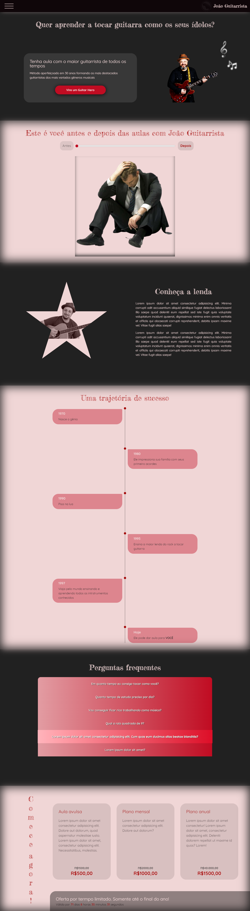

Abrir no computador, responsividade em construção

# Landing Page para professor de guitarra

### Pontos de atenção:
* :metal: Uso de blend-mode para tratamento de imagens (logo, imagem de background na primeira dobra, etc.)
* Toda manipulação de imagens foi feita com código. Nenhum asset foi tratado com editor de imagem
* menu hambúrguer animado feito somente com css
* Acordeon animado
* Linha do tempo animada em função do scroll
* Contador em tempo real até a data limite (31/12/2022)

### Tecnologias utilizadas:

* HTML
* CSS
* Javascript

### Como executar:

Acesse: https://marcelluscaio.github.io/CSV-LP-Professor-Guitarra-CTD/
